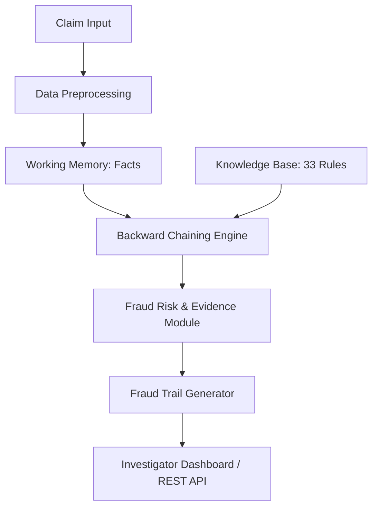

# Insurance-Claim Fraud Detection using Backward Chaining Rule Inference

A full-stack, explainable fraud-detection system built around a hand-written
**backward chaining** inference engine — not a black-box ML model. Every
verdict comes with the exact chain of rules and facts that proved it (the
**Fraud Trail**), which is the core novelty of this project.

- **Backend / reasoning engine**: pure Python, class-based backward chaining
- **REST API**: FastAPI
- **Dashboard**: Streamlit, multi-page, dark investigator theme
- **Database**: SQLite via SQLAlchemy (claims, rules, inference logs)
- **Data**: synthetic 500-claim dataset (Faker + NumPy), ~20% fraud-designed
- **Visualization**: Plotly + NetworkX (interactive reasoning-tree graph)

---

## 1. Setup

```bash
# from the project root
pip install -r requirements.txt

# generate the synthetic dataset (only needed once — already included,
# but re-run any time to regenerate with a different size/ratio)
python -m utils.data_generator
```

## 2. Run the dashboard

```bash
streamlit run app.py
```

Open the URL Streamlit prints (usually `http://localhost:8501`). The sidebar
lists all six pages.

## 3. Run the REST API (optional, separate from the dashboard)

```bash
uvicorn api.server:app --reload --port 8000
```

Swagger docs at `http://localhost:8000/docs`.

## 4. Quick CLI demo (for the review, no browser needed)

```bash
python demo.py                          # built-in high-risk example
python demo.py --claim-id CLM-1010      # any claim_id from data/claims.csv
python demo.py --json                   # print the full Fraud Trail as JSON
```

---

## Project structure

```
insurance_fraud_detection/
├── app.py                      # Streamlit entry point (Home page)
├── demo.py                     # CLI: single end-to-end inference
├── requirements.txt
├── .env                        # placeholder config (no secrets needed by default)
│
├── data/
│   ├── claims.csv              # synthetic dataset (500 claims, ~20% fraud)
│   └── rules.json              # knowledge base — 33 domain rules
│
├── database/
│   ├── db.py                   # SQLAlchemy models & session
│   └── fraud_detection.db      # auto-created on first run
│
├── engine/
│   ├── knowledge_base.py       # Module 2+3: preprocessing + KB loader
│   ├── rule_parser.py          # Module 3: rules.json -> Rule/Condition objects
│   ├── backward_chainer.py     # ⭐ Module 4: the backward chaining engine
│   ├── risk_scorer.py          # Module 5: risk level, confidence, priority
│   └── fraud_trail.py          # Module 6: proof tree -> JSON + narrative
│
├── api/
│   └── server.py               # Module 7 (API variant): FastAPI endpoints
│
├── utils/
│   ├── data_generator.py       # Module 1: synthetic data generation
│   ├── preprocessing.py        # dataset-level cleaning helpers
│   ├── visualizations.py       # Plotly charts + reasoning-tree figure
│   └── ui_common.py            # shared CSS + cached loaders for Streamlit
│
└── pages/                      # Module 7: Investigator Dashboard (Streamlit multi-page)
    ├── 1_🏠_Home.py
    ├── 2_🔍_Investigate_Claim.py
    ├── 3_📊_Analytics_Dashboard.py
    ├── 4_🌳_Fraud_Trail_Explorer.py
    ├── 5_📜_Rule_Base.py
    └── 6_ℹ️_About.py
```

---

## Architecture



---

## How backward chaining works here (for the viva)

The engine (`engine/backward_chainer.py`) implements classic goal-driven
resolution, the same idea behind Prolog:

1. **Hypothesis**: start from the goal `fraudulent_claim`.
2. **Rule lookup**: find every rule in the knowledge base whose
   `conclusion` equals the current goal. If several rules share a
   conclusion, they're tried as alternatives (**OR**) — any one succeeding
   proves the goal.
3. **Antecedent verification**: each rule has a list of conditions
   (antecedents) that must hold, combined with **AND** or **OR** per the
   rule. Each condition's `fact` is either:
   - a **raw fact** in working memory (e.g. `claim_amount_ratio`) — proven
     by directly applying the condition's operator and threshold
     (`>`, `>=`, `<`, `<=`, `==`, `!=`), or
   - a **sub-goal** — the conclusion of another rule (e.g.
     `unusual_claim_amount`) — in which case the engine **recurses**,
     going backward one level deeper.
4. **Base case**: recursion bottoms out at raw facts computed during
   preprocessing (`engine/knowledge_base.py::build_working_memory`).
5. **Cycle guard**: a `visited` set prevents infinite recursion (defensive;
   the shipped rule base is acyclic).
6. **Result**: every proof returns a `TreeNode` — the entire recursive
   proof tree — which `engine/fraud_trail.py` renders as the interactive
   Fraud Trail graph and the step-by-step narrative report.

Sample rule chain from the shipped knowledge base:

```
fraudulent_claim
 └─ R30: financial_red_flag AND evidence_red_flag
     ├─ financial_red_flag
     │   └─ R22: unusual_claim_amount AND early_claim_after_policy_start
     │       ├─ unusual_claim_amount  (R01: claim_amount_ratio > 2.0)
     │       └─ early_claim_after_policy_start (R08: days_since_policy_start < 30)
     └─ evidence_red_flag
         └─ R27: document_inconsistency AND damage_mismatch
             ├─ document_inconsistency (R09: document_incomplete == true)
             └─ damage_mismatch        (R12: damage_match == false)
```

### Why backward chaining over an ML classifier
- **Explainable by construction** — every verdict carries the exact rules
  and facts that proved it, satisfying audit/regulatory needs an ML score
  cannot.
- **Expert-knowledge driven** — rules are authored from domain expertise;
  no large labelled training set is required.
- **Extensible** — add a new fraud indicator as a new rule in
  `data/rules.json`; no retraining, no code changes to the engine.

---

## Rule base (`data/rules.json`)

33 rules across 5 categories: `financial`, `history`, `timing`, `evidence`,
`geographic`, plus `composite`/`goal` rules that combine them into the
top-level `fraudulent_claim` hypothesis. Each rule follows:

```json
{
  "rule_id": "R01",
  "name": "Unusual Claim Amount",
  "description": "...",
  "if": {"operator": "AND", "conditions": [
    {"fact": "claim_amount_ratio", "op": ">", "value": 2.0}
  ]},
  "then": {"conclusion": "unusual_claim_amount", "confidence": 0.85, "category": "financial"},
  "backward_question": "Does the claim amount significantly exceed the expected value?",
  "evidence_label": "Claim & Policy Details"
}
```

Rules can be browsed, filtered by category, and new ones added at runtime
from the **📜 Rule Base** dashboard page (persisted back to `rules.json`
and re-synced to the database).

---

## Validation

The synthetic dataset carries a hidden design label
(`label_is_fraud_synthetic`) used only to sanity-check the engine, never
fed into the rules themselves. Running every claim through the full
pipeline:

```
TP 100   FP 0   TN 400   FN 0
Precision 1.00   Recall 1.00
```

(Run this yourself: see `engine/knowledge_base.py` +
`engine/backward_chainer.py` + `engine/risk_scorer.py` combined over
`data/claims.csv`.)

---

## Dashboard pages

| Page | What it does |
|---|---|
| 🏠 Home | Project overview, architecture diagram, quick stats |
| 🔍 Investigate Claim | Pick an existing claim or enter a new one, run inference, view risk card + Fraud Trail tree + narrative + triggered-rules table, export JSON |
| 📊 Analytics Dashboard | Fraud rate, risk distribution donut, fraud by claim type / location / vehicle age, claims-over-time, top 10 triggered rules |
| 🌳 Fraud Trail Explorer | Revisit any past inference from the SQLite log, re-render its tree, export JSON |
| 📜 Rule Base | Browse all rules by category; add new rules via a form (persisted to `rules.json`) |
| ℹ️ About | Methodology, architecture, module map, references |

---

## REST API (`api/server.py`)

| Method | Path | Purpose |
|---|---|---|
| GET | `/health` | Health check + rule count |
| GET | `/rules` | List all rules |
| POST | `/claims` | Save a raw claim record |
| POST | `/infer` | Run backward chaining on a claim, returns the full Fraud Trail |
| GET | `/claims/{claim_id}` | Fetch a saved claim |

---

## Extending it

- **New rule**: add an entry to `data/rules.json`. No other code changes —
  the engine is fully data-driven, and the Rule Base dashboard page can add
  rules through the UI too.
- **Real dataset**: replace `data/claims.csv` (or `utils/data_generator.py`)
  with a loader that maps a real CSV (e.g. a Kaggle insurance-fraud
  dataset) onto the same column schema; everything downstream is unchanged.
- **Different DB**: swap the SQLite URL in `database/db.py` for Postgres/
  MySQL — SQLAlchemy handles the rest.

## References
- Aslam, F. et al. (2022). *Insurance fraud detection: Evidence from
  artificial intelligence and machine learning.*
- Farbmacher, H. et al. (2022). *An explainable attention network for
  fraud detection in claims management.*
- Hancock, J. T. et al. (2023). *Survey on categorical data for neural
  networks — applied to insurance fraud detection.*
- Liang, C. et al. (2020). *Uncovering insurance fraud conspiracy with
  network learning.*
